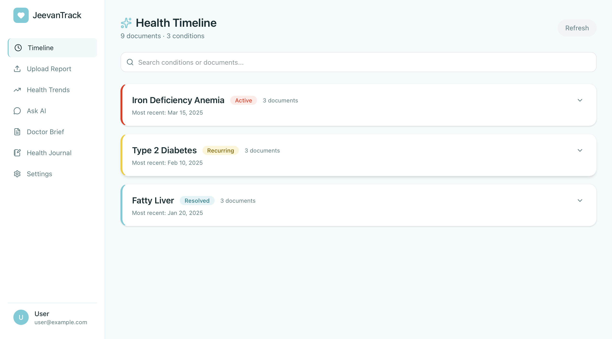
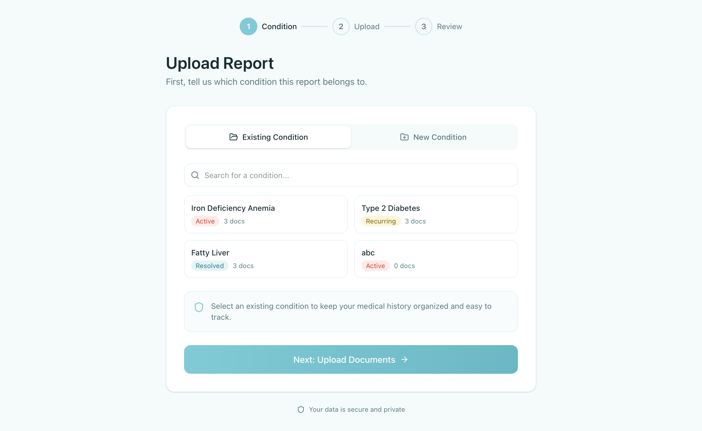
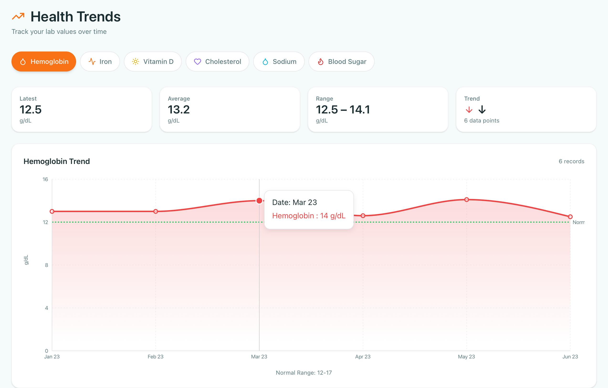
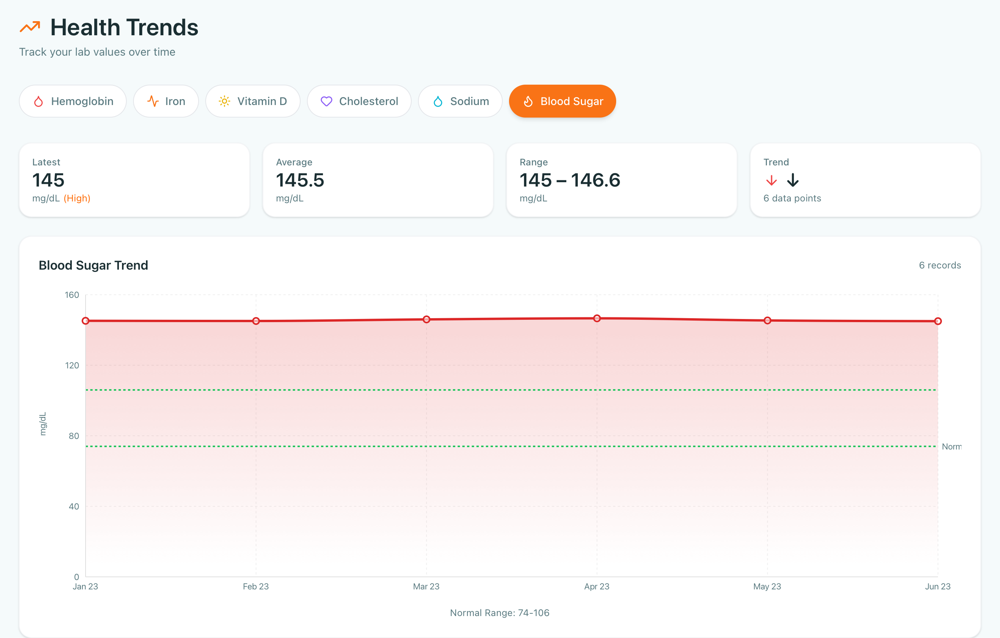
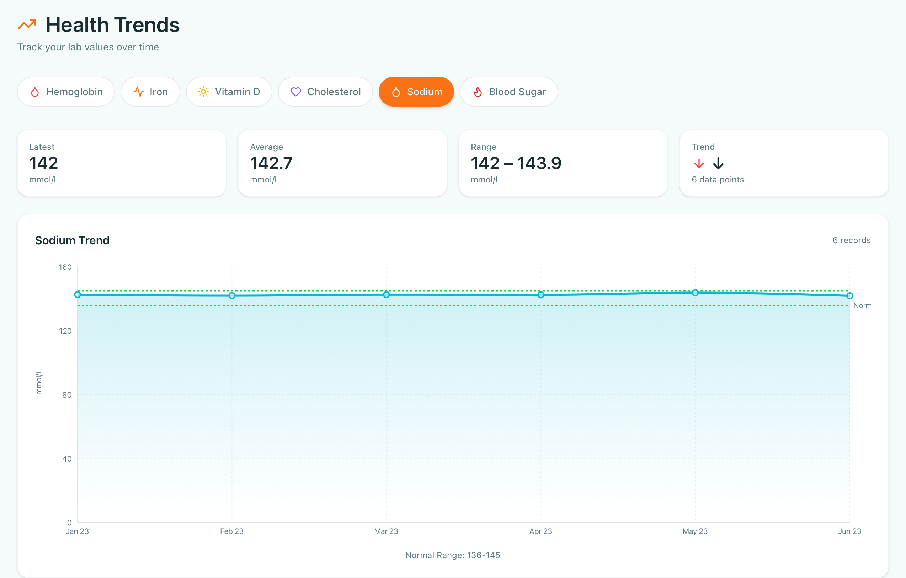
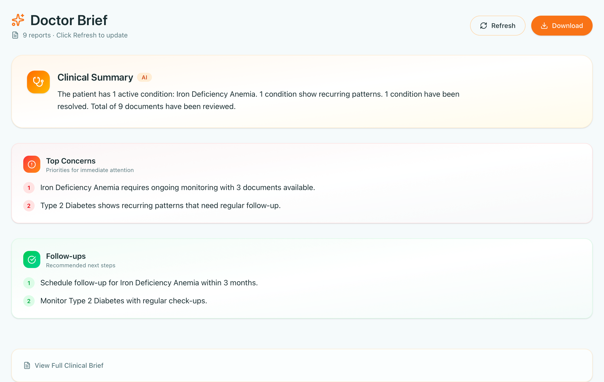
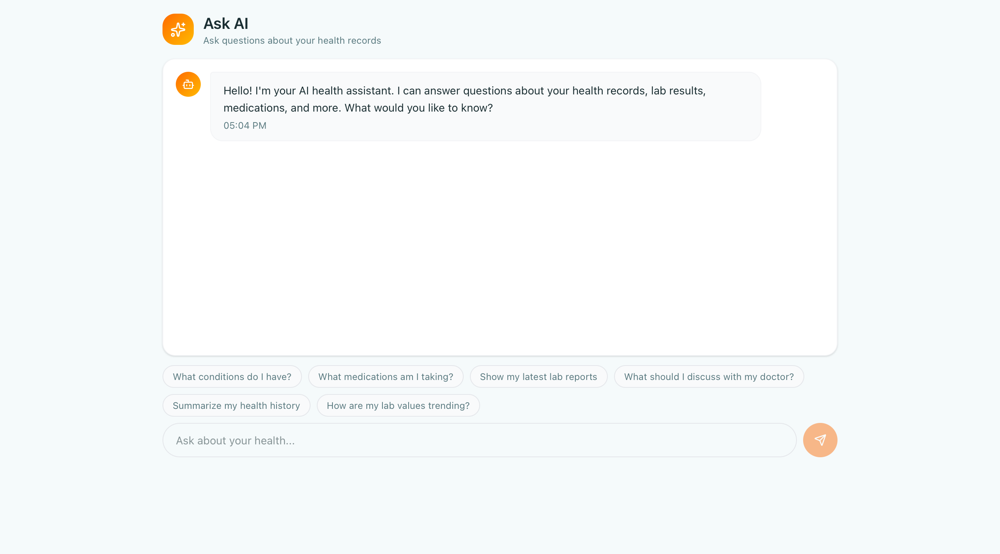
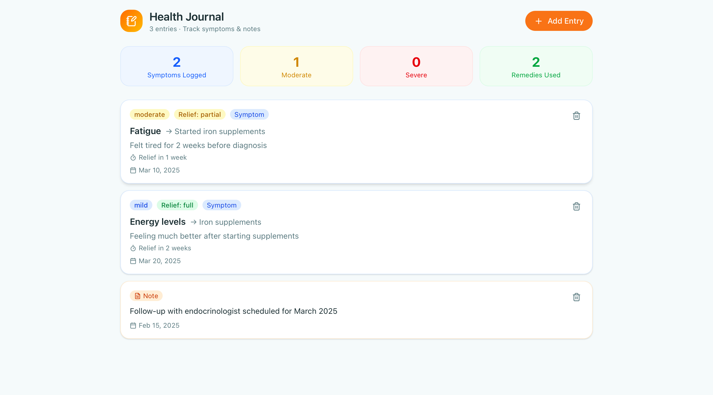
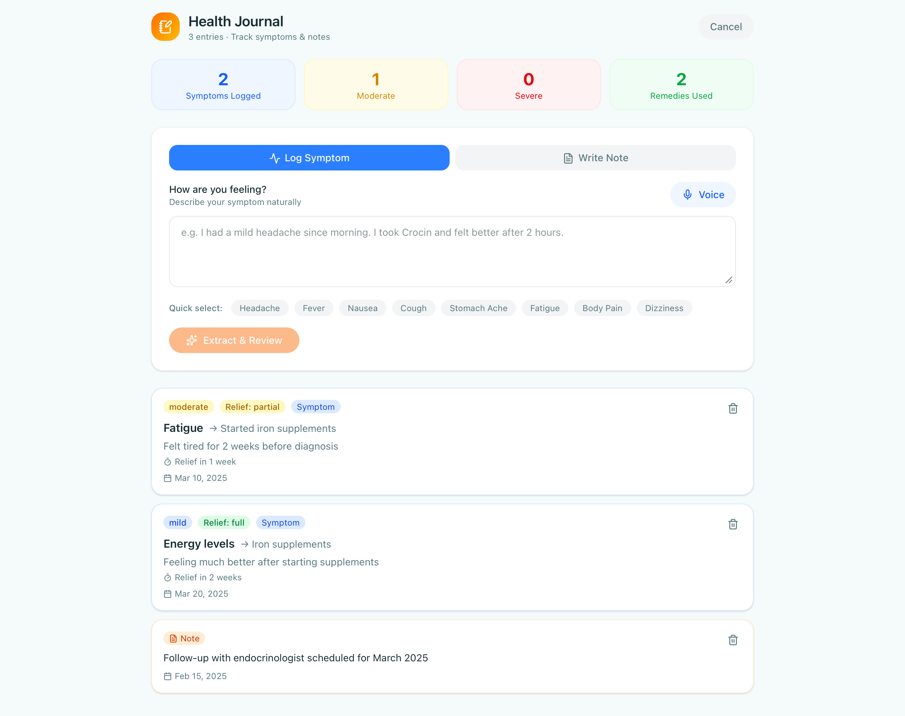

<div align="center">

# 🩺 JeevanTrack

### AI-Powered Personal Health Timeline

**Transform scattered medical reports into a unified, intelligent health record.**

[](https://jeevan-track.vercel.app)
[](https://jeevantrack-backend.onrender.com)
[](https://github.com/Mahi-S83/JeevanTrack)

[](https://nextjs.org/)
[](https://fastapi.tiangolo.com/)
[](https://supabase.com/)
[](https://deepmind.google/technologies/gemini/)

</div>

---

## 👥 Built By

| Role | Name |
|---|---|
| 🛠️ Developer | Mahi Singh |
| 🛠️ Developer | Saksham Trivedi |

---

## 🎭 Live Demo Account

A pre-seeded demo account is available so you can explore every feature without uploading your own files.

| | |
|---|---|
| **Email** | `demo82674@gmail.com` |
| **Password** | `demo@123` |

---

## 📌 The Problem

India has 70,000+ private hospitals and over a billion patients — yet most people's medical history exists as a scattered mess of WhatsApp forwards, physical folders, and memory.

This is especially painful for:
- **Migrant and mobile workers** who change cities and lose continuity of care
- **Rural patients** who travel long distances to see specialists and can't recall their history
- **Families managing elderly parents** across multiple hospitals and doctors
- **Anyone visiting a new doctor** who gets asked "do you have your old reports?" — and the answer is no

Tools like ABHA or Practo solve *storage* — they file documents. JeevanTrack was built to solve the harder problem: **understanding**. It fills the temporal reasoning gap that most health apps skip: *"your Vitamin D has been deficient in 3 out of 4 reports over 2 years"* or *"your blood sugar has been trending upward since 2022."*

---

## ✨ Features at a Glance

| Feature | Description |
|---|---|
| 🗂️ **Condition-Centric Timeline** | Reports grouped by condition (Active / Recurring / Resolved) |
| 🤖 **AI Report Extraction** | Gemini 2.5 Flash Vision parses PDFs and images — 80+ lab values in ~10 seconds |
| 📊 **Health Trends** | Interactive charts with normal range reference lines |
| 🩻 **Doctor Brief** | One-click AI-generated clinical summary for any appointment |
| 💬 **Ask AI** | Natural language Q&A over your personal health data |
| 📓 **Health Journal** | Log symptoms, medications, and notes |
| 🔗 **Secure Share Links** | Expiring QR-code links for doctors — no account needed |
| 🛡️ **Manual Fallback** | Full functionality even when the Gemini quota is exhausted |

---

## 🖼️ Screenshots

### Health Timeline — Condition-Centric View


All reports are grouped by medical condition with color-coded status badges: **Active** (red), **Recurring** (yellow), **Resolved** (blue).

### Upload Report — 3-Step Wizard


Select an existing condition or create a new one, then upload any PDF or image. Gemini Vision extracts structured data automatically.

### Health Trends — Hemoglobin with Normal Range


Interactive charts across Hemoglobin, Iron, Vitamin D, Cholesterol, Sodium, and Blood Sugar — with hover tooltips and normal range overlays.

### Health Trends — Blood Sugar & Sodium
| Blood Sugar | Sodium |
|---|---|
|  |  |

### Doctor Brief — AI Clinical Summary


One-button generation of Clinical Summary, Top Concerns, and Recommended Follow-ups — ready to share with any doctor.

### Ask AI — Personal Health Assistant


Chat with your own health data. Suggested questions for quick access. Answers grounded strictly in your uploaded reports.

### Health Journal
| Journal Overview | Log Symptom View |
|---|---|
|  |  |

Track symptoms with severity and relief data, linked medications, and freeform notes.

---

## 🏗️ Architecture

```
┌─────────────────────────────────────────────────────────────────────────────┐
│                          JeevanTrack Architecture                           │
├─────────────────────────────────────────────────────────────────────────────┤
│                                                                             │
│  ┌─────────────────────────────────────────────────────────────────────┐   │
│  │                        Frontend (Vercel)                            │   │
│  │  Next.js 14 · TypeScript · Tailwind CSS · Recharts · Lucide React  │   │
│  ├─────────────────────────────────────────────────────────────────────┤   │
│  │  Pages: Landing · Login · Dashboard · Upload · Brief · Trends      │   │
│  │          Ask AI · Journal · Settings                                │   │
│  │  Storage: localStorage (conditions, cache, demo data, journal)     │   │
│  └─────────────────────────────────────────────────────────────────────┘   │
│                                    │                                        │
│                               HTTPS + JWT                                  │
│                                    ▼                                        │
│  ┌─────────────────────────────────────────────────────────────────────┐   │
│  │                    Backend (Render)                                 │   │
│  │                    FastAPI · Python                                 │   │
│  ├─────────────────────────────────────────────────────────────────────┤   │
│  │  POST /upload · GET /timeline · POST /chat · GET /doctor-brief     │   │
│  │  GET /trends/{metric} · POST /share · GET /shared/{token}          │   │
│  └─────────────────────────────────────────────────────────────────────┘   │
│                                    │                                        │
│         ┌──────────────────────────┼──────────────────────────┐            │
│         ▼                          ▼                          ▼            │
│  ┌─────────────────┐     ┌─────────────────┐     ┌─────────────────────┐  │
│  │   Supabase      │     │   Gemini AI     │     │   localStorage      │  │
│  │   PostgreSQL    │     │   2.5 Flash     │     │   (Browser)         │  │
│  │   Auth · Store  │     │   Vision+Chat   │     │   Cache · Demo Data │  │
│  └─────────────────┘     └─────────────────┘     └─────────────────────┘  │
└─────────────────────────────────────────────────────────────────────────────┘
```

---

## 🔬 How It Works — Under the Hood

### Report Upload Pipeline

```
User uploads PDF/Image
        ↓
Frontend sends multipart/form-data POST /upload
  + Supabase JWT in Authorization header
        ↓
FastAPI extracts user UUID from JWT (supabase.auth.get_user)
        ↓
File bytes → Gemini 2.5 Flash Vision
  Prompt: return strict JSON — report_date, doctor_name,
  hospital_name, diagnosis, medicines[], lab_values{}
        ↓
Backend parses JSON (strips markdown fences)
JSONDecodeError → 500 with clear message (no silent failures)
        ↓
Structured data stored in Supabase PostgreSQL (jsonb column)
  alongside user_id, file_name, uploaded_at
        ↓
Chunk text built from normalized fields → Gemini Embedding-2
  generates 768-dim vector → stored in report_chunks (pgvector)
        ↓
Returns report_id + full extracted data to frontend
```

### AI Chat — Temporal Reasoning

```
User question → POST /chat
        ↓
Backend fetches ALL reports for user (filtered by user_id)
        ↓
Builds structured context:
  date · hospital · doctor · diagnosis · medicines · lab values
        ↓
Gemini 2.5 Flash with strict system prompt:
  "Answer ONLY from the user's actual report data."
        ↓
Natural language answer with cited values
```

### Doctor Brief Generation

```
Fetch all user reports
        ↓
Extract all diagnoses, medicines, lab values
Identify abnormal values (value outside normal range)
        ↓
Gemini prompt → Clinical Summary (2-3 sentences)
               + Top 3 Concerns
               + Recommended Follow-ups
        ↓
Formatted text returned to frontend
```

### Secure Share Links

```
POST /share
  → secrets.token_urlsafe(32) generates token
  → token + expiry stored in Supabase shares table

GET /shared/{token}
  → Validate: exists, not revoked, not expired
  → Return timeline + doctor brief (no auth required)

DELETE /share/{token}
  → Sets revoked=true in database
```

### Biomarker Standardization

Different labs use different names for the same marker:

```
Hb · HGB · Hemoglobin           → Hemoglobin
TSH · T.S.H · Thyroid Stim...   → TSH
```

The standardization engine maps all variations into a unified internal representation before storage — enabling cross-report trend analysis.

---

## 🧠 RAG Pipeline — Semantic Retrieval for Ask AI

JeevanTrack's Ask AI uses a two-tier retrieval system — semantic vector search as primary, SQL-based retrieval as fallback.

### Primary: Semantic Vector Search

```
User question
      ↓
Embed question using Gemini Embedding-2 (768 dimensions)
      ↓
Cosine similarity search via Supabase pgvector (HNSW index)
  SELECT ... ORDER BY embedding <=> query_embedding LIMIT 5
  filtered by user_id
      ↓
Filter chunks with similarity score ≥ 0.3
      ↓
Pass only relevant chunks as context to Gemini 2.5 Flash
      ↓
Natural language answer cited from personal health data
```

### Fallback: SQL-Based Retrieval

If vector search returns no results above the similarity threshold:

```
Fetch all user reports via SQL (WHERE user_id = ?)
      ↓
Build structured context from extracted_data (top 20 lab values)
      ↓
Send to Gemini 2.5 Flash with strict prompt
```

### Embedding Pipeline (on every upload)

```
Report uploaded → Gemini Vision extracts structured data
      ↓
Build chunk text from normalized fields:
  report_date · doctor · hospital · diagnosis · medicines · lab values
      ↓
Gemini Embedding-2 generates 768-dimensional vector
      ↓
Vector stored in report_chunks table (Supabase pgvector)
```

### Why This Matters

| Query Type | SQL / Keyword Search | RAG Semantic Search |
|---|---|---|
| "When was my iron low?" | ✅ Works (exact match) | ✅ Works |
| "Any time my numbers looked concerning" | ❌ Fails | ✅ Works |
| "Issues related to low energy" | ❌ Fails | ✅ Works (surfaces iron/thyroid/B12 reports) |
| "Problems with my blood" | ❌ Fails | ✅ Works |

### Tech Decisions

| Decision | Choice | Reason |
|---|---|---|
| Vector DB | Supabase pgvector | Already on Supabase — no new infrastructure |
| Index type | HNSW | Supports high-dimensional vectors, fast approximate search |
| Embedding model | Gemini Embedding-2 (768d) | Same API key as extraction — no additional service |
| Retrieval strategy | Two-tier (semantic + SQL fallback) | Graceful degradation if embedding service is down |
| Standalone vector DB | Skipped (Chroma/Pinecone) | pgvector is right-sized for per-user report counts |

---

## 🧠 Why JeevanTrack Goes Beyond a Generic Chatbot

| Capability | Generic LLM | JeevanTrack |
|---|---|---|
| **Persistent memory across reports** | ❌ No memory between sessions | ✅ Every report stored permanently |
| **Temporal reasoning** | ❌ Single-report analysis only | ✅ "Iron was low Feb 2023, normal Aug 2023, low again Jan 2024" |
| **Structured extraction** | ❌ Returns prose summaries | ✅ Strict JSON with 80+ lab values, units, normal ranges |
| **Identity-linked records** | ❌ No concept of "your" data | ✅ Every report linked to a verified user UUID |
| **Zero manual entry** | ❌ User must copy-paste values | ✅ Full extraction + storage in one API call |
| **Doctor-ready output** | ❌ Requires manual formatting | ✅ Aggregated clinical brief in one click |
| **Secure doctor sharing** | ❌ No sharing mechanism | ✅ Expiring QR-code links, no doctor account needed |
| **Semantic health search** | ❌ Keyword only | ✅ RAG with vector embeddings — fuzzy queries work |

> **Example:** Upload three CBC reports over six months. JeevanTrack automatically tracks hemoglobin from 8.9 → 10.5 → 12.1 g/dL, identifies anemia recovery, updates the health timeline, and generates progress insights — without any manual comparison.

---

## 🗂️ Repository Structure

```
JeevanTrack/
├── frontend/                   # Next.js 14 application
│   ├── app/                    # App Router pages
│   │   ├── page.tsx            # Landing page
│   │   ├── login/              # Auth pages
│   │   ├── dashboard/          # Main dashboard
│   │   ├── upload/             # Report upload wizard
│   │   ├── timeline/           # Condition timeline
│   │   ├── trends/             # Health trend charts
│   │   ├── ask/                # AI chat interface
│   │   ├── brief/              # Doctor brief
│   │   ├── journal/            # Health journal
│   │   └── settings/           # User settings
│   ├── components/             # Reusable React components
│   ├── lib/                    # Supabase client, utilities
│   ├── public/                 # Static assets
│   ├── package.json
│   └── .env.local              # Frontend environment variables
│
├── backend/                    # FastAPI Python application
│   ├── main.py                 # Entry point, all route definitions
│   ├── requirements.txt        # Python dependencies
│   └── .env                    # Backend environment variables
│
├── .env-example                # Environment variable template
├── api-contract.md             # API endpoint documentation
├── schema.md                   # Database schema
└── README.md
```

---

## 🚀 Local Setup

### Prerequisites

- Node.js 18+
- Python 3.10+
- A Supabase project
- A Google Gemini API key

### 1. Clone the Repository

```bash
git clone https://github.com/Mahi-S83/JeevanTrack.git
cd JeevanTrack
```

### 2. Backend Setup

```bash
cd backend

# Create and activate virtual environment
python -m venv venv
source venv/bin/activate        # Windows: venv\Scripts\activate

# Install dependencies
pip install -r requirements.txt

# Create environment file
cp ../.env-example .env
# Fill in your values (see Environment Variables section below)

# Run the backend
uvicorn main:app --reload --port 8000
```

Backend will be available at `http://localhost:8000`
API docs (auto-generated by FastAPI): `http://localhost:8000/docs`

### 3. Supabase Setup

Run the following SQL in your Supabase SQL Editor:

```sql
-- Enable pgvector
create extension if not exists vector;

-- Reports table
create table reports (
  id uuid primary key default gen_random_uuid(),
  user_id uuid references auth.users(id) on delete cascade,
  file_name text,
  extracted_data jsonb,
  uploaded_at timestamptz default now()
);

-- RAG chunks table
create table report_chunks (
  id uuid primary key default gen_random_uuid(),
  report_id uuid references reports(id) on delete cascade,
  user_id uuid references auth.users(id) on delete cascade,
  content text,
  embedding vector(768),
  created_at timestamptz default now()
);

create index on report_chunks using hnsw (embedding vector_cosine_ops);

-- Shares table
create table shares (
  id uuid primary key default gen_random_uuid(),
  token text unique not null,
  expires_at timestamp not null,
  revoked boolean default false,
  created_at timestamp default now()
);

-- Timeline entries
create table timeline_entries (
  id uuid primary key default gen_random_uuid(),
  report_id uuid references reports(id) on delete cascade,
  date date,
  summary text
);

-- Vector similarity search function
create or replace function match_chunks(
  query_embedding vector(768),
  match_user_id uuid,
  match_count int default 5
)
returns table (
  id uuid,
  report_id uuid,
  content text,
  similarity float
)
language sql stable
as $$
  select id, report_id, content,
    1 - (embedding <=> query_embedding) as similarity
  from report_chunks
  where user_id = match_user_id
  order by embedding <=> query_embedding
  limit match_count;
$$;
```

### 4. Frontend Setup

```bash
cd frontend

# Install dependencies
npm install

# Create environment file
cp ../.env-example .env.local
# Fill in your values

# Run the development server
npm run dev
```

Frontend will be available at `http://localhost:3000`

---

## ⚙️ Environment Variables

### Backend `.env`

```env
SUPABASE_URL=https://your-project.supabase.co
SUPABASE_SERVICE_KEY=your-supabase-service-role-key
GEMINI_API_KEY=your-google-gemini-api-key
```

| Variable | Description | Where to Get |
|---|---|---|
| `SUPABASE_URL` | Your Supabase project URL | Supabase Dashboard → Settings → API |
| `SUPABASE_SERVICE_KEY` | Service role key (not anon key) | Supabase Dashboard → Settings → API |
| `GEMINI_API_KEY` | Google Gemini API key | [Google AI Studio](https://aistudio.google.com/) |

> ⚠️ Use the **service role key** for the backend (not the anon key). The service key bypasses Row Level Security and is required for server-side operations.

### Frontend `.env.local`

```env
NEXT_PUBLIC_SUPABASE_URL=https://your-project.supabase.co
NEXT_PUBLIC_SUPABASE_ANON_KEY=your-supabase-anon-key
NEXT_PUBLIC_API_URL=http://localhost:8000
```

| Variable | Description |
|---|---|
| `NEXT_PUBLIC_SUPABASE_URL` | Supabase project URL (same as backend) |
| `NEXT_PUBLIC_SUPABASE_ANON_KEY` | Supabase **anon** (public) key |
| `NEXT_PUBLIC_API_URL` | Backend URL (localhost for dev, Render URL for production) |

---

## 📦 Key Dependencies

### Backend (`requirements.txt`)

```
fastapi          # Async Python web framework
uvicorn          # ASGI server
python-dotenv    # Environment variable loading
pydantic         # Data validation and serialization
python-multipart # File upload handling (multipart/form-data)
supabase         # Supabase Python client (auth + database)
google-genai     # Google Gemini AI SDK (Vision + Embeddings)
httpx            # Async HTTP client
```

### Frontend (`package.json`)

```json
{
  "next": "^14.2.35",
  "react": "^18.3.1",
  "@supabase/supabase-js": "^2.108.2",
  "recharts": "^3.8.1",
  "lucide-react": "^1.21.0",
  "framer-motion": "^12.40.0",
  "react-datepicker": "^9.1.0",
  "tailwindcss": "^4",
  "typescript": "^5"
}
```

---

## 🗄️ Database Schema

```sql
-- User reports with extracted data stored as JSONB
reports (
  id          UUID PRIMARY KEY,
  user_id     UUID REFERENCES auth.users,
  file_name   TEXT,
  uploaded_at TIMESTAMP,
  extracted_data JSONB
)

-- RAG vector chunks (one per report)
report_chunks (
  id         UUID PRIMARY KEY,
  report_id  UUID REFERENCES reports,
  user_id    UUID REFERENCES auth.users,
  content    TEXT,
  embedding  VECTOR(768)
)

-- Timeline entries per condition
timeline_entries (
  id           UUID PRIMARY KEY,
  report_id    UUID REFERENCES reports,
  date         DATE,
  summary      TEXT
)

-- Secure share tokens
shares (
  id         UUID PRIMARY KEY,
  token      TEXT UNIQUE,
  expires_at TIMESTAMP,
  revoked    BOOLEAN DEFAULT false,
  created_at TIMESTAMP
)
```

---

## 🎭 Demo Account

| | |
|---|---|
| **Email** | `demo82674@gmail.com` |
| **Password** | `demo@123` |

**Pre-loaded data:**
- 3 conditions: Iron Deficiency Anemia (Active), Type 2 Diabetes (Recurring), Fatty Liver (Resolved)
- 9 documents spread across conditions
- 3 health journal entries
- Full health trends for Hemoglobin, Iron, Vitamin D, Cholesterol, Sodium, Blood Sugar

---

## 📡 API Endpoints

| Method | Endpoint | Description |
|---|---|---|
| `POST` | `/upload` | Upload report, trigger Gemini extraction + embedding |
| `GET` | `/timeline` | Fetch user's health timeline |
| `POST` | `/chat` | Ask AI — RAG semantic retrieval + Gemini generation |
| `GET` | `/doctor-brief` | Generate AI clinical summary |
| `GET` | `/trends/{metric}` | Get historical values for a biomarker |
| `POST` | `/share` | Generate expiring share token |
| `GET` | `/shared/{token}` | Public view (no auth required) |
| `DELETE` | `/share/{token}` | Revoke a share link |
| `DELETE` | `/reports/{id}` | Delete a report |

---

## ✅ Feature Status

### Working

| Feature | Notes |
|---|---|
| ✅ Authentication (signup/login/logout) | Supabase Auth |
| ✅ Medical report upload | PDF + images |
| ✅ Gemini Vision extraction | Tested on real 19-page report — 80+ values |
| ✅ RAG pipeline | Gemini Embedding-2 + pgvector HNSW index |
| ✅ Semantic Ask AI | Fuzzy queries work — "issues related to low energy" |
| ✅ Condition-centric timeline | Color-coded, cached |
| ✅ Health trend charts | Normal range reference lines |
| ✅ Doctor Brief | AI-generated clinical summary |
| ✅ Secure share links with QR code | Expiring tokens |
| ✅ Health Journal | Symptom logging with severity + relief |
| ✅ Demo account | Pre-seeded data, all features accessible |

### Partial / Roadmap

| Feature | Status |
|---|---|
| ⚠️ PDF preview | File URL stored; in-browser viewer not implemented |
| ⚠️ Voice journal | UI ready; voice recording not implemented |
| ❌ Family health profiles | Planned |
| ❌ Row-Level Security (RLS) | Planned |
| ❌ Push notifications | Planned |
| ❌ Regional language support (Hindi/Tamil/Telugu) | High priority |

---

## ⚠️ Known Limitations

1. **Gemini API Quota** — Free tier allows ~20 requests/day. If exhausted, upload falls back to manual entry.
2. **Render Cold Start** — Free tier backend may sleep after 15 minutes. First request takes 30–60 seconds.
3. **Share Links** — Currently share all reports, not user-selected reports.
4. **Gemini Accuracy** — Extraction accuracy may vary with handwritten or very low-quality scanned reports.

---

## 🗺️ Deployment

| Component | Platform | URL |
|---|---|---|
| Frontend | Vercel | https://jeevan-track.vercel.app |
| Backend | Render | https://jeevantrack-backend.onrender.com |
| Database | Supabase | Managed cloud |

---

## 🔮 Roadmap

**Short-term**
- Regional language support (Hindi, Tamil, Telugu, Bengali) — critical for rural accessibility
- Offline mode for low-connectivity areas
- WhatsApp integration for report sharing
- ABHA (Ayushman Bharat Health Account) integration

**Medium-term**
- Doctor and community health-worker access modules
- Automated medication reminders via SMS
- Health risk scoring for preventive care
- Integration with Jan Aushadhi (generic medicines) for cost-aware prescriptions

**Long-term vision**
JeevanTrack aims to become a health memory layer — giving people, regardless of literacy, location, or income, the ability to understand their own health history and walk into any doctor's office with their complete medical story.

---

## 📄 License

MIT — see [LICENSE](LICENSE) for details.

---

<div align="center">

**JeevanTrack** — *Your health, remembered.*

*Mahi Singh · Saksham Trivedi*

</div>
